### **total hours: 38h**

# June 1st: Start of the project!

I chose the MCU for the keyboard. nice!nano v2. and I will use TCA9555DBR I^2C GPIO expansion board to get more pins.

I will use 6*15 matrix. It is not the best layout but it makes matrix more clear and easy to design.

Brief BOM for now 
- 1N4148 THT Diodes
- SMD 0603_1608 Caps
- SMD 0603_1608 Resistors
- 0.91 inch OLED
- 11E Rotary encoder2
- nice!nano MCU
- TCA9555DBR Expansion chip

Completed schematic of key matrix. I deleted unused switches on the matrix

**Total time spent: 2h**

---
# June 2nd: PCB and case done

I completed pcb design. There was some problem with pin layouts since I was struggling with pinout of MCU :(
Also, my PCB was too small so i needed to fit routes in small space, which was quite hard process. But i finished it. yay

### Schematic  
[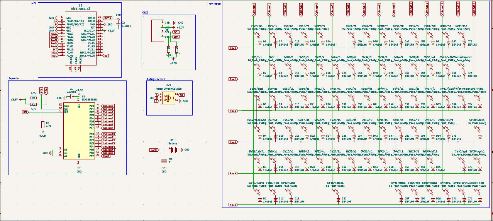](images/6.2/schematic.png)

### PCB Layout
[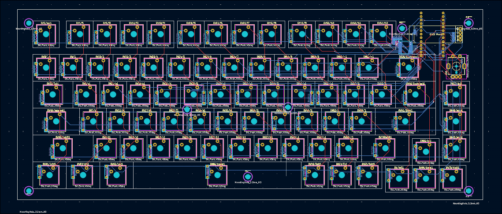](images/6.2/PCB.png)

battery will be added to the design later.

and I finished case design on onshape. I'm going to use heatset insert and tray mount.

[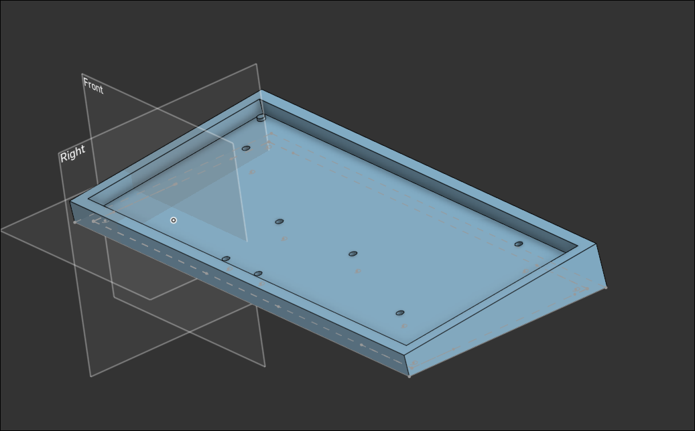](images/6.2/case.png)
[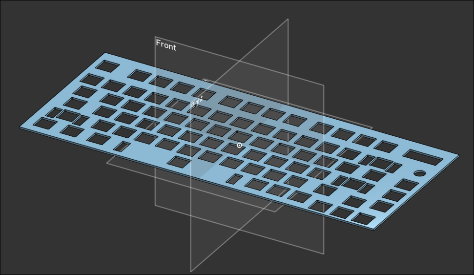](images/6.2/Plate.png)
`

**Total time spent: 6h**

---
# June 3rd: Change of plan

I was planning to use tray mount, but i changed my mind to use top mount. I changed some of schematic and redesigned+rewired pcb. I was crashing out :DDDDDDDDDD

I realized that my wiring was too messy so i chose to get column routes by bottom part of the PCB. Also, some pin layout was changed cuz symbol of expansion board didn't match its footprint.

Moved MCU to make it more close to right corner.

### Schematic  
[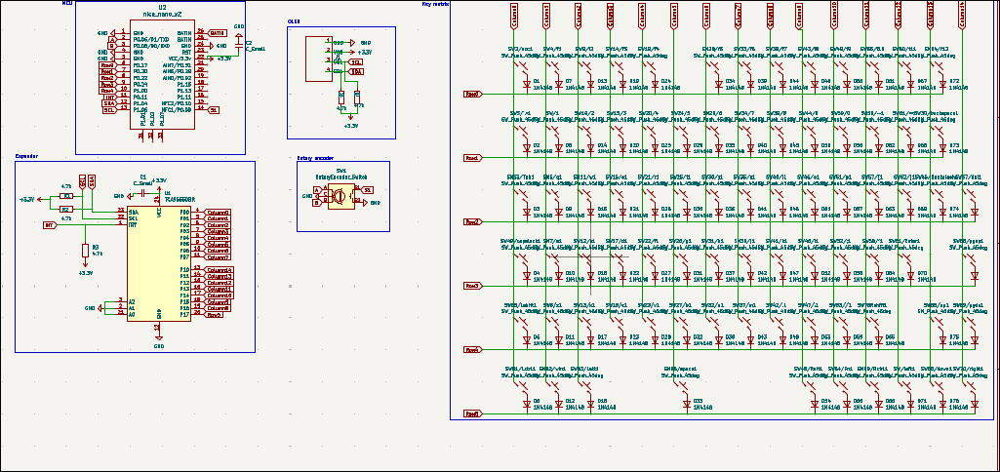](images/6.3/schematic.png)

### PCB Layout
[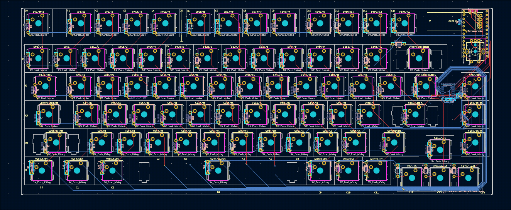](images/6.3/pcb.png)

I also re-designed case and plate for top mount. I'm going to use m3 screw and heatset. Case is not finished and doesnt have heatset and screw hole yet.

### Case
[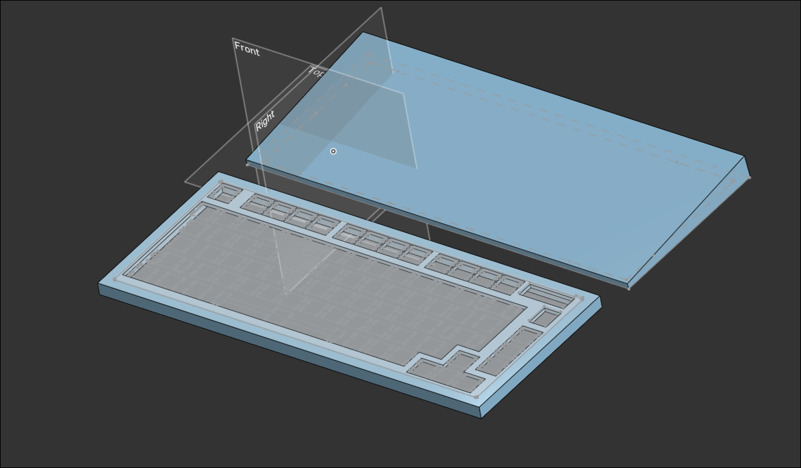](images/6.3/case.png)

### Plate
[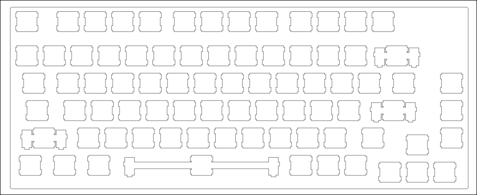](images/6.3/plate_layout.png)
[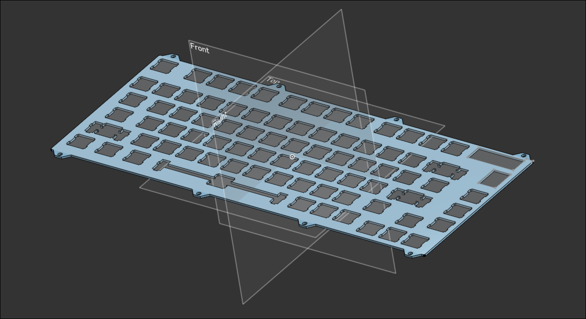](images/6.3/plate_3d.png)

**Total time spent: 8h**

---
# June 4th: Case done

I finished top mount case and plate. I changed M3 screws to M2.5 since it was a bit bigger than I initially thought. 
I designed top case and edited some of bottom case and plate to make it top mount case.

### Case

### Plate
[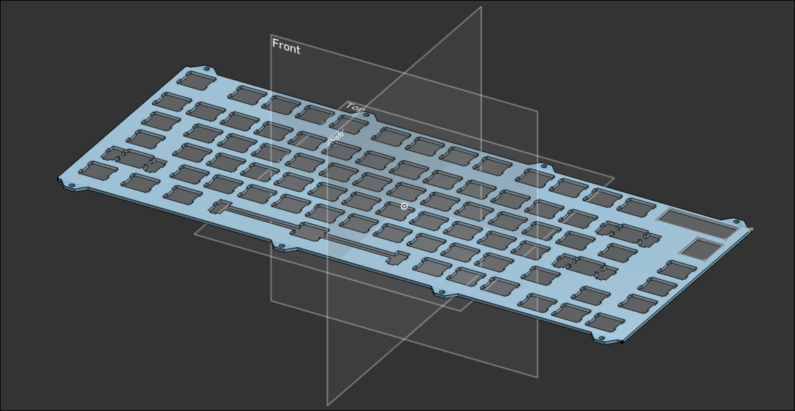](images/6.4/plate.png)

I also added stabiliser hole footprint to PCB. I found footprints from github. It was perfect but pin layout was opposite so i needed to flip switches on schematic. which was easy cuz i labled all keys before :))

Also, I had to adjust some wiring on PCB so it doesn't overlap with stabilizer mounting holes.

[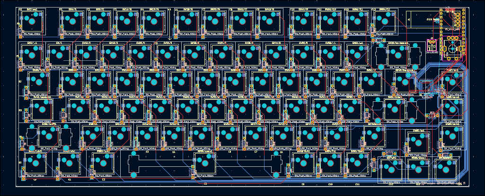](images/6.4/pcb.png)

I changed normal PCB mount to kailh hot swap sockets. So i had to change all switch footprint to hot swap ones. I re-wired and adjusted some. 

<del>Why am i changing stuff this much</del>

Also, I Made BOM chart and worked on some part sourcing via aliexpress and nice! website.
I exported test gerber file from kicad and used to quote on JLC PCB.

| Component          | Price              |Source|
| --------           | -------            |---------     |
| Nice!nano MCU + header pins | $38.62 (€33.93) | https://splitkb.com|
| Kailh hot swap sockets | $8.54 (€7.50) | Aliexpress |
| Akko V3 Pro Cream Blue Switch (90pcs) | $31.95 (€28.07) | Aliexpress |
| 0.91 inch OLED | $2.47 (€2.17) | Aliexpress|
| TCA9555 Expansion Board | $3.48 (€3.06) | Aliexpress |
| Gateron Plate Mounted V2 Stabilizers | $17.62 (€15.48) | Aliexpress |
| EC11 Rotary Encoder | $5.09 (€4.47) | Aliexpress |
| 1N4148 Diodes (100pcs) | $1.41 (€1.24) | Aliexpress |
| 0603 SMD 100nF Capacitor (100pcs) | $1.30 (€1.14) | Aliexpress |
| 0603 SMD 4.7K Resistor (100pcs) | $1.02 (€0.94) | Aliexpress |
| M2.5 heatset insert (50pcs) | $2.32 (€2.04) | Aliexpress |
| M2.5 Screws | $5.22 (€4.59) | Aliexpress |
| foam | $6.48 (€5.69) | Aliexpress |
| Keycaps | $19.97 (€17.55) | Aliexpress |
| PCB | $19.80 | JLC PCB |
| Total | $165.29 | - |

15.29 over
optional - Aviator coil cable(11.95)

**Total time spent: 7h**

---
# June 5th: BOM Update and ZMK start! + more changes

I added battery into my design so i added connector footprint on the pcb. also, I found alternative nice nano v2 and added to cart on aliexpress. So i can source all parts on aliexpress now.

**Total time spent: 2h**

[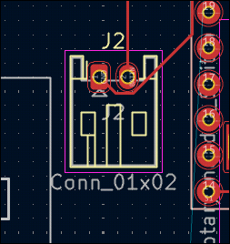](images/6.5/jst_pcb.png)

### Updated BOM
| Component          | Price              |Source|
| --------           | -------            |---------     |
| NRF52840 Development Board | $4.38 (€3.84) | Aliexpress |
| Kailh hot swap sockets | $8.54 (€7.50) | Aliexpress |
| Akko V3 Pro Cream Blue Switch (90pcs) | $31.95 (€28.07) | Aliexpress |
| 0.91 inch OLED | $2.47 (€2.17) | Aliexpress|
| TCA9555 Expansion Board | $3.48 (€3.06) | Aliexpress |
| PCB mounted Screw-in Original Cherry PCB Stabilizers | $11.12 (€9.74) | Aliexpress |
| EC11 Rotary Encoder | $5.09 (€4.47) | Aliexpress |
| 1N4148 Diodes (100pcs) | $1.41 (€1.24) | Aliexpress |
| 0603 SMD 100nF Capacitor (100pcs) | $1.30 (€1.14) | Aliexpress |
| 0603 SMD 4.7K Resistor (100pcs) | $1.02 (€0.94) | Aliexpress |
| M2.5 heatset insert (50pcs) | $2.32 (€2.04) | Aliexpress |
| M2.5 Screws | $5.22 (€4.59) | Aliexpress |
| foam | $6.48 (€5.69) | Aliexpress |
| Keycaps | $19.97 (€17.55) | Aliexpress |
| Battery + connector | $8.33 (€7.30) | Aliexpress |
| Cable | $11.96 (€10.48) | Aliexpress |
| PCB | $19.80 | JLC PCB |
| Total | $141.34 | - |

I made some changes on case design. I removed bottom shell and made bottom lid instead. what fits into upper case. and I extended upper case to make room for pcb. Also added hole for usb c port. I spent too much time deciding case design :(

[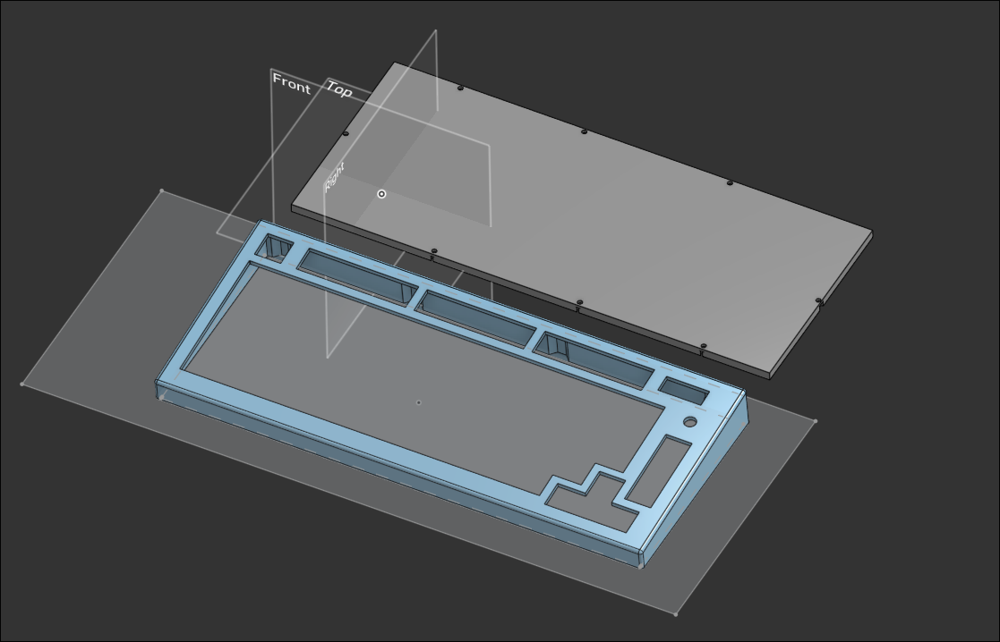](images/6.5/case.png)

For ZMK, since I'm new to ZMK, I started looking into documentation and setting up basic things. It is kinda confusing but I think I'm starting to understnad how it works. Getting some help from chat gpt + ZMK documentation

**Total time spent: 5h**

---
# June 6th: Almost done!

I think there will be some errors on my ZMK config, it is not working now so i'm finding problems but It is on repository https://github.com/hjw1112/customboard-zmk-config. there are too much files in firmware repo so i'm just putting the link to the repo. Plz check the repo for source code.(I put the compiled code in firmware folder tho.)

And I added some holes for M2.5 screw on pcb and plate. Also added standoffs in aliexpress cart. There is not much things to say cuz there was just hard config-ing and simple cad changes today.

I had so much github action errors. like 80+. I deleted the repo to restart so i don't have screenshots but i was struggling A LOT and still not found solution.
I will work on ZMK more tmr.

[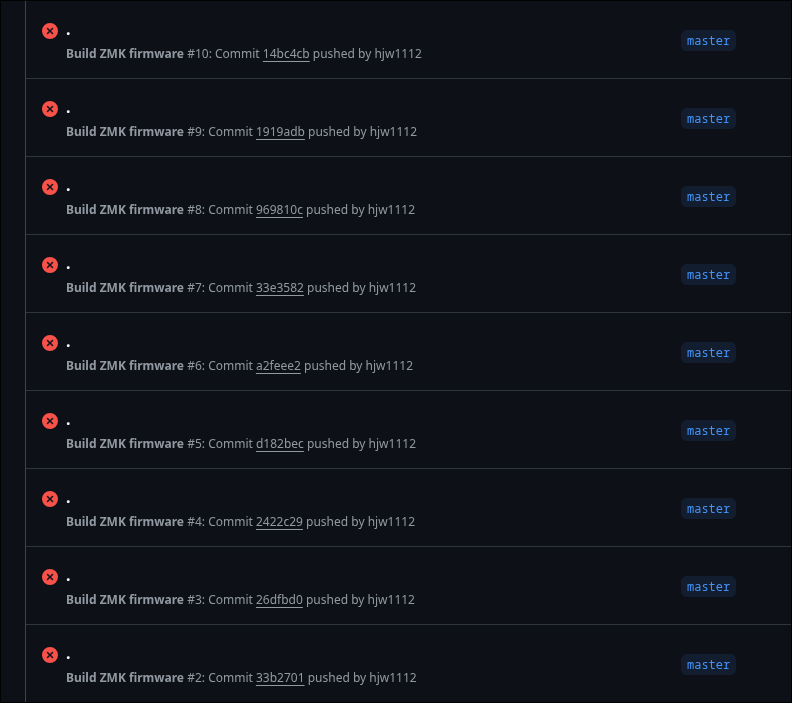](images/6.6/errors.png)

+june 7th. 
STILL NOT WORKING!!!!!!!!!!!!!!!!!

### Photo of some of ZMK config and CAD changes
[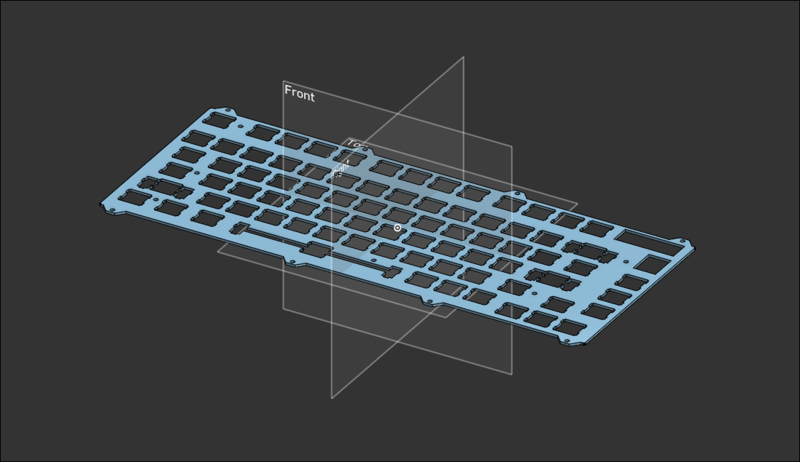](images/6.6/plate.png)

[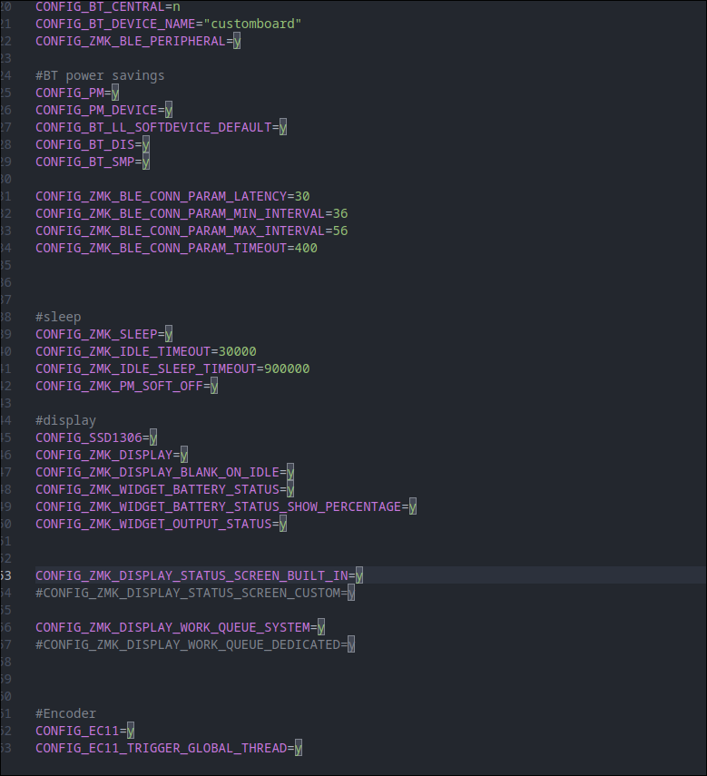](images/6.6/firmware1.png)
[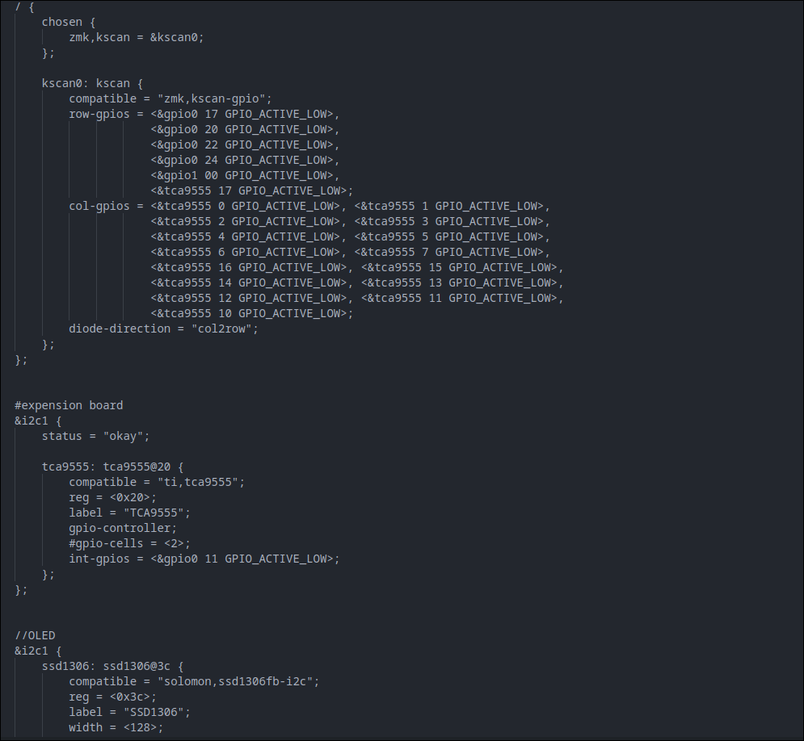](images/6.6/firmware2.png)

**Total time spent: 2h + 3h(June 7th)**

---
# June 8th: Done!!!!

I learnt a lot about ZMK. I wasn't really understanding how it works and kinda depended on ai. But now I know how these thing work and completed writing config. And github action successfully compiled the config. The problem that i was struggling with was about expansion board driver. But I found out that ZMK doesn't support my board. So I did some research and found similar board with 8 pins. which was half of my board. So i used two of these board in the configuration to make 16 pin board :)) and it WORKS now!! yayyy 
[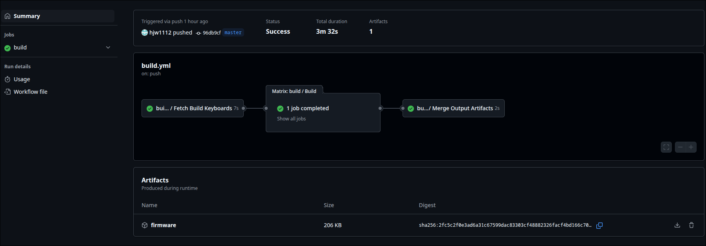](images/6.8/success.png)

Also, I made BOM for the project and found sources of all parts today. and made some minor changes to case.

**Total time spent: 3h**

---
# June 10th: More changes :((

I made some change to BOM and PCB design.

First, I changed some routing on pcb since i thought there is much better way than putting all column route at the bottom of the pcb. So I moved some column route. I also changed the footprint of switches because old one only had 3 pins. Which is problem cuz my switches will have 5 pins.

And for BOM, I added M2.5 hex nut and replaced standoff to alternative. So total cost is increased a bit. Also, I didn't calculate shipping cost from jlc pcb, so pcb will cost ~40$ total. I added all updated info to csv file in root dir and readme.md

### Updated BOM
| Component          | Price              |Source|
| --------           | -------            |---------     |
| NRF52840 Development Board | $4.38 (€3.84) | Aliexpress |
| Kailh hot swap sockets | $8.54 (€7.50) | Aliexpress |
| Akko V3 Pro Cream Blue Switch (90pcs) | $31.95 (€28.07) | Aliexpress |
| 0.91 inch OLED | $2.47 (€2.17) | Aliexpress|
| TCA9555 Expansion Board | $3.48 (€3.06) | Aliexpress |
| PCB mounted Screw-in Original Cherry PCB Stabilizers | $11.12 (€9.74) | Aliexpress |
| EC11 Rotary Encoder | $5.09 (€4.47) | Aliexpress |
| 1N4148 Diodes (100pcs) | $1.41 (€1.24) | Aliexpress |
| 0603 SMD 100nF Capacitor (100pcs) | $1.30 (€1.14) | Aliexpress |
| 0603 SMD 4.7K Resistor (100pcs) | $1.02 (€0.94) | Aliexpress |
| M2.5 heatset insert (50pcs) | $2.32 (€2.04) | Aliexpress |
| M2.5 Screws | $5.22 (€4.59) | Aliexpress |
| foam | $6.48 (€5.69) | Aliexpress |
| Keycaps | $19.97 (€17.55) | Aliexpress |
| Battery + connector | $8.33 (€7.30) | Aliexpress |
| Cable | $11.96 (€10.48) | Aliexpress |
| PCB | $19.30 + 17.52(shipping) | JLC PCB |
| Standoffs | 4.60$ | Aliexpress |
| M2.5 nut | 0.89$ | Aliexpress |
| Total | $141.34 | - |

**Total time spent: 2h**

