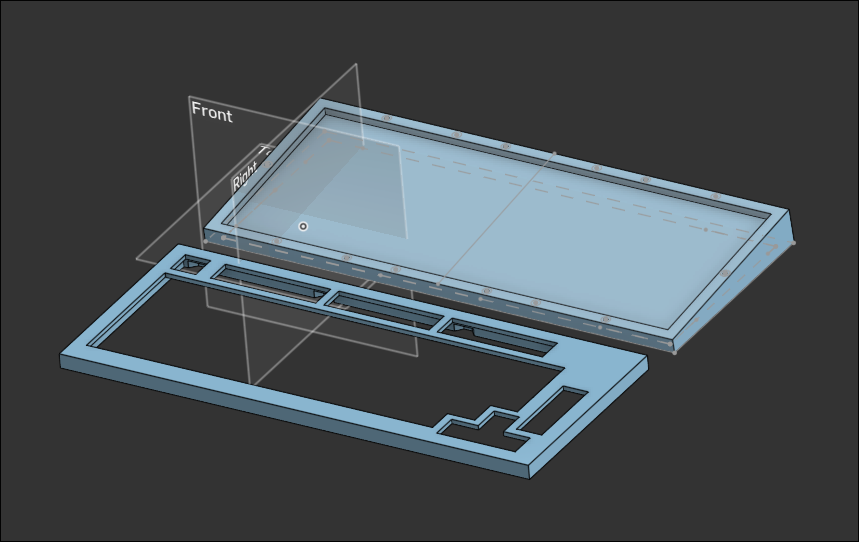

# June 1st: Start of the project!

I chose the MCU for the keyboard. nice!nano v2. and I will use TCA9555DBR I^2C GPIO expansion board to get more pins.

I will use 6*15 matrix. It is not the best layout but it makes matrix more clear and easy to design.

Brief BOM for now 
- 1N4148 THT Diodes
- SMD 0603_1608 Caps
- SMD 0603_1608 Resistors
- 0.91 inch OLED
- 11E Rotary encoder2
- nice!nano MCU
- TCA9555DBR Expansion chip

Completed schematic of key matrix. I deleted unused switches on the matrix

**Total time spent: 2h**

---
# June 2nd: PCB and case done

I completed pcb design. There was some problem with pin layouts since I was struggling with pinout of MCU :(
Also, my PCB was too small so i needed to shove routes in small space, which was quite hard process. But i finished it anyways.

### Schematic  

### PCB Layout

battery will be added to the design. (Maybe)

and I finished case design on onshape. I'm going to use heatset insert for tray mount.

`

**Total time spent: 6h**

---
# June 3rd: Change of plan

I was planning to use tray mount, but i changed my mind to use top mount. I changed some of schematic and redesigned+rewired pcb. I was crashing out :DDDDDDDDDD

I realized that my wiring was too messy so i chose to get column routes by bottom part of the PCB. Also, some pin layout was changed cuz symbol of expansion board didn't match its footprint.

Moved MCU to make it more close to right edge.

### Schematic  

### PCB Layout

I also re-designed case and plate for top mount. I'm going to use m3 screw and heatset. Case is not finished and doesnt have heatset and screw hole yet.

### Case

### Plate

**Total time spent: 8h**

---
# June 4th: Case done

I finished top mount case and plate. I changed M3 screws to M2.5 since it was a bit bigger than i initially thought. 
I designed top case and edited some of bottom case and plate to make it top mount case.

### Case

### Plate

I also added stabiliser hole footprint to PCB. I found footprints from github. It was perfect but pin layout was opposite so i needed to flip switches on schematic. which was easy cuz i labled all keys before :))

Also, I had to adjust some wiring on PCB so it doesn't overlap with stabilizer mounting holes.

I changed normal PCB mount to kailh hot swap sockets. So i had to change all switch footprint to hot swap ones. I re-wired and adjusted some. 

<del>Why am i changing stuff this much</del>

Also, I Made BOM chart and worked on some part sourcing via aliexpress and nice! website.
I exported test gerber file from kicad and used to quote on JLC PCB.

| Component          | Price              |Source|
| --------           | -------            |---------     |
| Nice!nano MCU + header pins | $38.62 (€33.93) | https://splitkb.com|
| Kailh hot swap sockets | $8.54 (€7.50) | Aliexpress |
| Akko V3 Pro Cream Blue Switch (90pcs) | $31.95 (€28.07) | Aliexpress |
| 0.91 inch OLED | $2.47 (€2.17) | Aliexpress|
| TCA9555 Expansion Board | $3.48 (€3.06) | Aliexpress |
| Gateron Plate Mounted V2 Stabilizers | $17.62 (€15.48) | Aliexpress |
| EC11 Rotary Encoder | $5.09 (€4.47) | Aliexpress |
| 1N4148 Diodes (100pcs) | $1.41 (€1.24) | Aliexpress |
| 0603 SMD 100nF Capacitor (100pcs) | $1.30 (€1.14) | Aliexpress |
| 0603 SMD 4.7K Resistor (100pcs) | $1.02 (€0.94) | Aliexpress |
| M2.5 heatset insert (50pcs) | $2.32 (€2.04) | Aliexpress |
| M2.5 Screws | $5.22 (€4.59) | Aliexpress |
| foam pad | $6.48 (€5.69) | Aliexpress |
| Keycaps | $19.97 (€17.55) | Aliexpress |
| PCB | $19.80 | JLC PCB |
| Total | $165.29 | - |

15.29 over
optional - Aviator coil cable(11.95)

**Total time spent: 7h**
